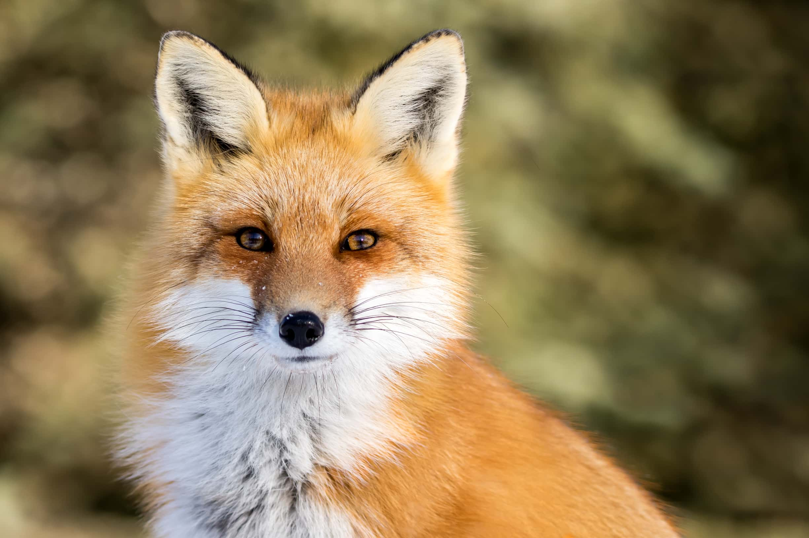

# Red Fox

Red foxes live around the world in many diverse habitats including forests, grasslands, mountains, and deserts. They also adapt well to human environments such as farms, suburban areas, and even large communities. The red fox's resourcefulness has earned it a legendary reputation for intelligence and cunning.

### Behavior and Communication

Red foxes are solitary hunters who feed on rodents, rabbits, birds, and other small game—but their diet can be as flexible as their home habitat. Foxes will eat fruit and vegetables, fish, frogs, and even worms. If living among humans, foxes will opportunistically dine on garbage and pet food.

Like a cat's, the fox's thick tail aids its balance, but it has other uses as well. A fox uses its tail (or “brush”) as a warm cover in cold weather and as a signal flag to communicate with other foxes.

Foxes also signal each other by making scent posts—urinating on trees or rocks to announce their presence.

### Breeding

In winter, foxes meet to mate. The vixen (female) typically gives birth to a litter of 2 to 12 pups. At birth, red foxes are actually brown or gray. A new red coat usually grows in by the end of the first month, but some red foxes are golden, reddish-brown, silver, or even black. Both parents care for their young through the summer before they are able to strike out on their own in the fall.

Red foxes are hunted for sport, though not extensively, and are sometimes killed as destructive pests or frequent carriers of rabies.
![Branching] (bbfbf.jpg)
